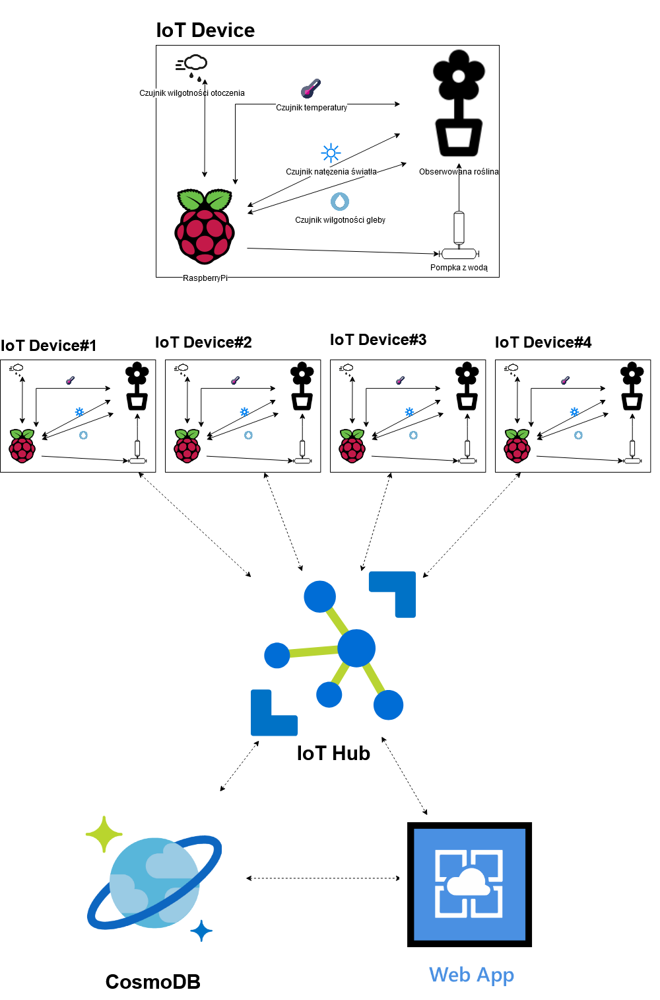

# IoTAzurePi

## Wymagania aplikacji ##

Wszystkie wymagane zależności znajdują się w pliku `package.json`. Aby je zainstalować należy przejść do folderu, w którym znajduje się plik i uruchomić komendę:

`npm install`

Wymagana jest wersja npm >= 6.0.0.

## Lokalne uruchamianie aplikacji ##

Przed uruchomieniem aplikacji należy ustawić 2 zmienne środowiskowe:
- IotHubConnectionString - łańcuch znaków identyfikujący usługę IoTHub,
- EventHubConsumerGroup - nazwa identyfikująca usługę EventHub, w przypadku IoT Hub jest to domyślnie "$Default".

W przypadku gdy chcemy zapisywać otrzymane dane do bazy danych należy ustawić zmienną środowiskową:

-  mongoDBConnectionString - łańcuch znaków identyfikujący bazę danych MongoDB (może to być zarówno lokalna baza danych jak i umieszczona w chmurze np. Azure CosmosDB).

Aplikacja może zostać uruchomiona poleceniem:

`npm start`

Domyślnie zostanie uruchomiona na porcie `3000`.

## Umieszczenie aplikacji w instancji Azure App Service ##

`Uwaga: Usługa App Service musi być umieszczona na maszynie z systemem operacyjnym Windows`

### Konfiguracja

W zakładce `Settings/Configuration/Application Settings` należy dodać wszystkie wymagane zmienne środowiskowe które aplikacja wykorzystuje, tzn.:

- IotHubConnectionString
- EventHubConsumerGroup
- mongoDBConnectionString

W zakładce `Settings/Configuration/General Settings` należy zezwolić na użycie "Web sockets". Pozwoli to na odczytywanie danych w czasie rzeczywistym.

### Sposoby umieszczenia aplikacji w App Service

#### 1. Metoda Visual Studio Code

W zakładce "Rozszerzenia" należy wyszukać wtyczkę o nazwie "Azure App Service". Po jej instalacji powinna pokazać się dodatkowa zakładka o nazwie "Azure". Należy dodać tam swoje konto Azure oraz wybrać subskrypcję, w której dodana jest usługa "App Service". Ostatnim krokiem jest naciśnięcie przycisku "Deploy to Web App" oraz wybranie folderu z projektem zawierającym aplikację.

#### 2. Metoda Azure CLI
TODO

#### 3. Metoda Azure GUI
TODO

## 2@KSDE'2020 Rozproszony system monitoringu zrealizowany w oparciu o chmurę i internet rzeczy

Celem projektu jest opracowanie rozproszonego systemu monitorowania,
zrealizowanego korzystając z chmury (AWS, Azure), oraz koncepcji
internetu rzeczy. W ramach projektu należy przygotować urządzenia
pomiarowe / monitorujące na bazie komputerów Raspberry Pi, które
umożliwią zbieranie oraz przesyłanie danych do platformy
administracyjnej / nadzorującej zrealizowanej na bazie dostępnych
rozwiązań chmurowych (IoT Core, IoT Hub). System musi umożliwiać zarówna
odbieranie wiadomości z urządzeń pomiarowych i przetwarzanie ich na
platformie chmurowej, jak i wysyłanie wiadomości (na przykład danych
konfiguracyjnych) z panelu administracyjnego w chmurze do urządzeń
pomiarowych. Dodatkowo panel administracyjny powinien umożliwiać
przeprowadzenia analiz na danych pomiarowych.

## Idea na zastosowanie ##
[Inspiracja.](https://www.hackster.io/105122/smart-plant-iot-59cbc3)

IoT ogród. Poprzez aplikację Azure WebApp użytkownik mógłby zarządzać swoimi roślinami oraz obserwować dane wysyłane z czujników (temperatura, wilgotność pomieszczenia, wilgotność gleby, natężenie światła) za pomocą prostego GUI. Znajdowałyby się tam odpowiednie funkcję:
- Wizualizacja danych otrzymanych z czujników
- Możliwość podlania rośliny za pomocą wysłania wiadomości sterującej do raspberryPi, która uruchomi pompkę z wodą
- Przechowywanie danych w bazie danych CosmoDB

