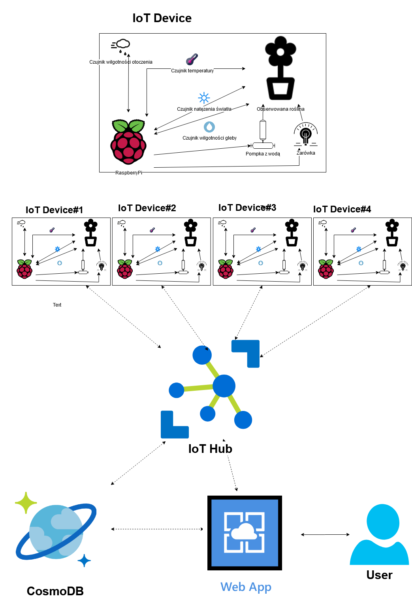

IoTAzurePi - 2@KSDE'2020 Rozproszony system monitoringu zrealizowany w oparciu o chmurę i internet rzeczy
=======================

## [Opis projektu](#opis-projektu)

Celem projektu jest opracowanie rozproszonego systemu monitorowania,
zrealizowanego korzystając z chmury (AWS, Azure), oraz koncepcji
internetu rzeczy. W ramach projektu należy przygotować urządzenia
pomiarowe / monitorujące na bazie komputerów Raspberry Pi, które
umożliwią zbieranie oraz przesyłanie danych do platformy
administracyjnej / nadzorującej zrealizowanej na bazie dostępnych
rozwiązań chmurowych (IoT Core, IoT Hub). System musi umożliwiać zarówna
odbieranie wiadomości z urządzeń pomiarowych i przetwarzanie ich na
platformie chmurowej, jak i wysyłanie wiadomości (na przykład danych
konfiguracyjnych) z panelu administracyjnego w chmurze do urządzeń
pomiarowych. Dodatkowo panel administracyjny powinien umożliwiać
przeprowadzenia analiz na danych pomiarowych.

----------------
## [Zastosowanie projektu - IoT ogród](#zastosowanie-projektu---iot-ogród)

[Inspiracja.](https://www.hackster.io/105122/smart-plant-iot-59cbc3) 

Poprzez aplikację WebAppGUI użytkownik mógłby zarządzać swoimi roślinami oraz obserwować dane wysyłane z czujników (temperatura, wilgotność pomieszczenia, wilgotność gleby, natężenie światła) za pomocą prostego GUI. Znajdowałyby się tam odpowiednie funkcję:

- Wizualizacja danych otrzymanych z czujników
- Możliwość sterowania parametrami takimi jak wilgotność gleby czy natężenie światła za pomocą pompki z wodą oraz żarówką, które są sterowane poprzez RaspberryPi.
- Przechowywanie danych w bazie danych CosmoDB

