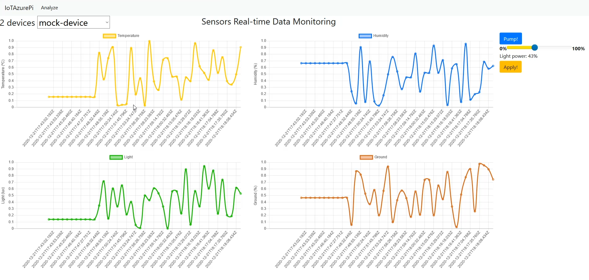
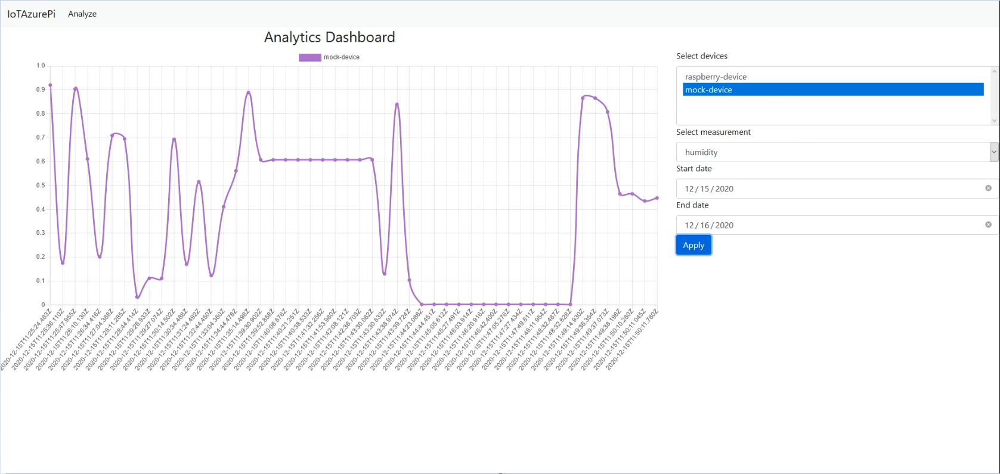

Interfejs użytkownika
===================

## [Opis](#opis)

Panel administracyjny został wykonany w postaci aplikacji webowej  przeznaczonej dla użytkownika w celu zarządzania całym środowiskiem. Użytkownik może, za jej pomocą, wizualizować otrzymane dane, oraz sterować parametrami takimi jak wilgotność gleby oraz natężenie światła. Aplikacja może być uruchomiona lokalnie - użytkownik będzie musiał być w tej samej sieci by móc się nią posługiwać, lub uruchomiona na środowisku *Azure App Service*, przez co użytkownik będzie miał dostęp do aplikacji z każdego miejsca gdzie będzie miał dostęp do internetu.

-----------------------
## [Schemat aplikacji](#schemat-aplikacji) 

Panel składa się z dwóch stron:

Panelu głównego z którego:

- Możemy obserwować aktualne dane.
- Podlać roślinę za pomocą naciśnięcie przycisku Pump!
- Ustawić natężenie światła lampki nad rośliną.

Te funkcję możemy wykonywać do każdego przyłączonego urządzenia IoT. Wystarczy wybrać go z paska znajdującego się w lewym górnym rogu ekranu.

Strony analitycznej na której możemy wczytać i porównać ze sobą dane z jednego lub wielu urządzen, które zostały zebrane i zapisane w bazie danych cosmoDB. Wystarczy wybrać urządzenia z których chcemy obserwować dane, wybrać parametr i wybrać okres czasu z których mają zostać pobrane dane.  

