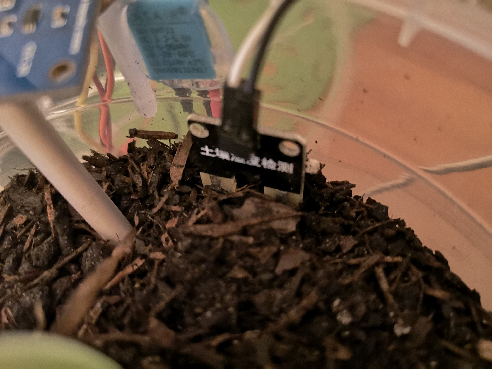
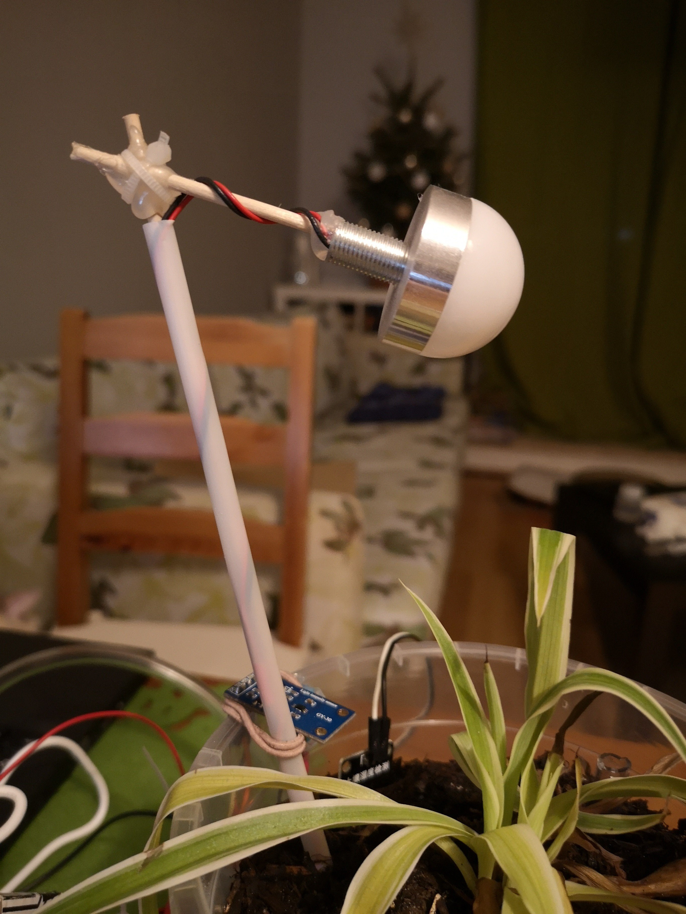
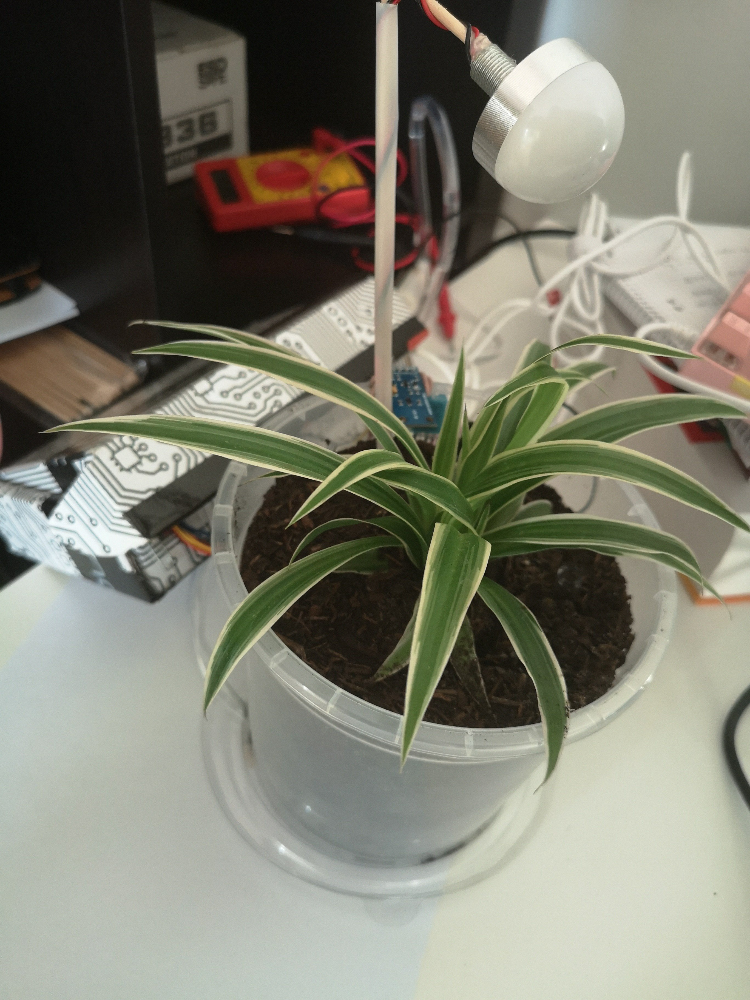
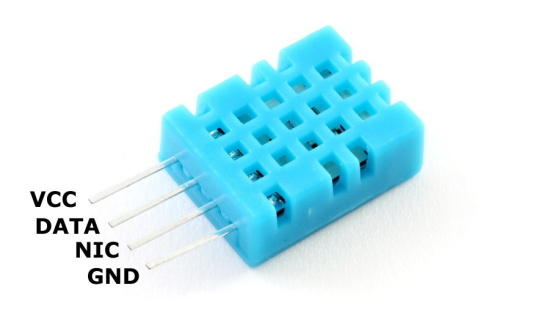
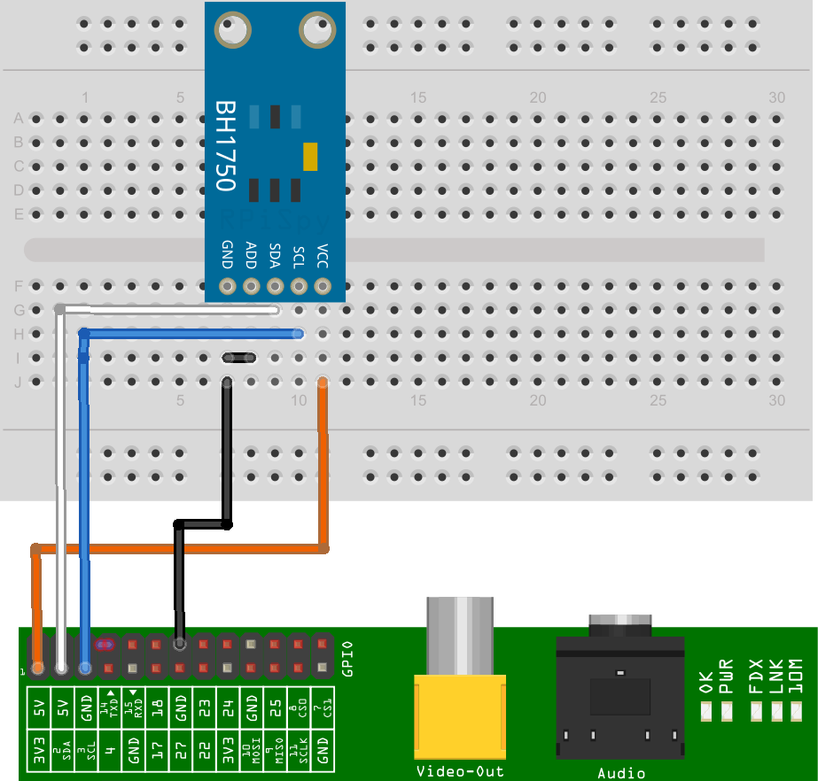
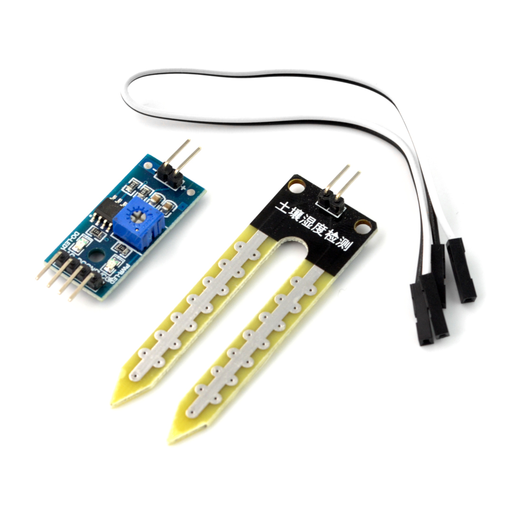

Opis doniczki
====================

## [Opis całego schematu](#opis-calego-schematu)

Gotowy schemat połączeniowy doniczki zaprezentowano poniżej:


Składa się on z:

- lampki LED
- czujnika wilgotności gleby
- przetwornika analogowo-cyfrowego
- czujnika natężenia światła
- czujnika temperatury i wilgotności
- pompki do wody
- mostka H

Do pomiaru temperatury i wilgotności użyto czujnik wilgotności DHT11. Został on umieszczony na zewnętrznej części doniczki, aby zbierać pomiar temperatury i wilgotności pomieszczenia. Urządzenie komunikuje się z Raspberry Pi za pomocą interfejsu jednoprzewodowego podłączonego do GPIO 17. DHT11 umieszczony na doniczce:


W celu zmierzenia naświetlenia rośliny wykorzystano czujnik natężenia światła BH1750. Zamieszczono go na brzegu doniczki, nad powierzchnią gleby, aby znajdował się na podobnym poziomie co roślina i jego wyniki jak najdokładniej oddawały warunki uprawianej rośliny. Czujnik jest cyfrowy i komunikuje się z jednostką centralną za pomocą magistrali I2C.


Pomiar wilgotności gleby odbywa się za pomocą sondy pomiarowej umieszczonej w glebie, która została podłączona do detektora. Pod wpływem wilgotności zmienia się rezystancja sondy i detektor generuje sygnał proporcjonalny do wilgotności. Sygnał ten jest sygnałem analogowym. Raspberry Pi nie ma wbudowanego przetwornika analogowo-cyfrowego, więc zastosowano zewnętrzny moduł ADS1115. Jest to moduł z przetwornikiem analogowo-cyfrowym o rozdzielczości 16 bitów i komunikujący się za pomocą magistrali I2C. Detektor podłączono do modułu, a moduł został podłączony do Raspberry Pi. Konwersja sygnału otrzymanego z detektora jest realizowana w jednostce centralnej




Lampka i silnik są sterowane za pomocą dwukanałowego mostka H - L293D. Mostek ten jest zasilany napięciem 5V i za pomocą sygnałów PWM generowanych przez Raspberry Pi możliwe sterowanie natężeniem światła lub pompką. Mostek ma wbudowane diody zabezpieczające, dzięki którym możemy zabezpieczyć Raspberry Pi przed zwarciem. Do silnika została podłączona gumowa rurka, a silnik został umieszczony w zbiorniku z wodą. Lampka została umieszczona w glebie, a przewody zasilające zostały zabezpieczone przed wilgocią.





Gotowa doniczka prezentuje się następująco:




Opis czujników
====================

Do zrealizowania części sprzętowej skorzystano z modułów komunikacyjnych wbudowanych w platformę mikroprocesorową Raspberry Pi. Rozpisane piny urządzenia znajdują się na rysunku poniżej:

---------
## [Czujnik temperatury i wilgotności DHT11](#czujnik-temperatury-i-wilgotności-dht11)


Do pomiaru temperatury i wilgotności użyto czujnik wilgotności DHT11. Jest to czujnik cyfrowy z interfejsem jednoprzewodowym. Zakres jego pracy dla temperatury to od -20 °C do +60 °C, a wilgotności od 5 % do 95 % RH. Czujnik ma rozdzielczość 8-bitową, przez co jego dokładność to 1°C oraz ±1 % RH.




Czujnik podłączony został do napięcia 3.3 V urządzenia Raspberry Pi (pin 1), uziemienie do pinu 9 oraz dane zostały podłączone do GPIO 17 dostępnego na pinie 11.
W celu poprawnej komunikacji jednoprzewodowej konieczne jest zastosowanie rezystora pomiędzy napięciem a linią danych. Rezystor powinien mieć wartość o 4.7k do 10k Ohm. Połączenie czujnika z RPi zostało przedstawione na poniższym rysunku:


Do połączenia się z czujnikiem wykorzystano gotową bibliotekę od Adafruit. W celu instalacji tej biblioteki trzeba wykonać następujące kroki:
Zainstalować potrzebne narzędzia:

        
        sudo apt-get update
        sudo apt-get install build-essential python-dev
        

Następnie pobrać bibliotekę z repozytorium na githubie:
git clone https://github.com/adafruit/Adafruit_Python_DHT.git
cd Adafruit_Python_DHT
Następnie zainstalować bibliotekę dla Pythona 2 i Pythona 3 za pomocą komend:

        sudo python setup.py install
        sudo python3 setup.py install


Do komunikacji z czujnikiem został napisany skrypt w języku Python. Przykładowy kod programu umożliwiający komunikację z czujnikiem:

        
        import sys

        import Adafruit_DHT

        # 11 stand for DHT-11 and 17 stands for GPIO pin
        humidity, temperature = Adafruit_DHT.read_retry(11, 17)

        if humidity is not None and temperature is not None:
        print('Temp={0:0.1f}*  Humidity={1:0.1f}%'.format(temperature, humidity))
        else:
        print('Failed to get reading. Try again!')
        sys.exit(1)
        
---------

## [Czujnik natężenia światła](#czujnik-natężenia-światła)

Zastosowanym czujnikiem światła jest BH1750. Jest to czujnik przetwarzający natężenie światła o długości z zakresu od 320 nm do 1050 nm na mierzalną (np. poprzez zastosowanie mikrokontrolera) proporcjonalną częstotliwość. Zakres działania czujnika to 1-65535 lx (luksów) z rozdzielczością 1 lub 4 lx w zależności od wybranego trybu pracy. Komunikuje się poprzez interfejs I2C (TWI), czyli dwie linie: danych - SDA i zegarową SCL.


Czujnik podłączony został do napięcia 3.3 V z urządzenia Raspberry Pi, uziemienie do GND oraz dane zostały podłączone do GPIO 2 (SDA) oraz do GPIO 3 (SCL) został podłączony zegar interfejsu I2C.



Do komunikacji z czujnikiem wykorzystano magistralę I2C. Po podłączeniu pinu ADD do uziemienie urządzenie ma adres 0x23. Można ustawić różne tryby odczytu. Wykorzystany został tryb 0x20, jest to tryb umożliwiający odczyt z dokładnością do 1 lx oraz pozwalający na wyłączenie urządzenia po odczycie w celu oszczędzenia energii. Przykładowy kod w języku Python:

        
        ```
        def convert_GY30_to_Number(data):
        # Simple function to convert 2 bytes of data
        # into a decimal number.
        result=(data[1] + (256 * data[0])) / 1.2
        return (result)

        def read_data_GY30():
        bus = smbus.SMBus(1)  # Rev 2 Pi uses 1
        # 0x23 is an addres of device, 0x20 is measurement at 1lx resolution.
        # Time typically 120ms
        # Device is automatically set to Power Down after measurement.
        data = bus.read_i2c_block_data(0x23,0x20)
        return convert_GY30_to_Number(data)
        ```

---------
## [Czujnik wilgotności gleby](#czujnik-wilgotności-gleby)

Zasilany jest napięciem od 3,3 V do 5 V.  Urządzenie składa się z trzech części: sondy pomiarowej, modułu detektora oraz przewodów. Sondy należy połączyć z modułem głównym przy pomocy przewodów i umieścić w glebie, której wilgotność będzie mierzona.

Czujnik posiada wyjście cyfrowe D0 sygnalizujące przekroczenie ustawionej za pomocą potencjometru wartości oraz analogowe A0 przy pomocy którego uzyskuje się dokładną wartość wilgotności. Za pomocą potencjometru ustawiany jest próg, po którego przekroczeniu wyjście D0 przechodzi ze stanu wysokiego w stan niski. Czujnik posiada także wyjście analogowe A0, które należy podłączyć do wyprowadzenia przetwornika A/C, a następnie możliwe jest za pomocą interfejsu I2C połączenie z urządzeniem Raspberry Pi. 




---------
## [Pompa do wody](#pompa-do-wody) 

Do podlewania rośliny w doniczce została wykorzystana pompka do wody działająca na bazie komutatorowego silnika prądu stałego. Pompa zasilana jest napięciem od 2.5 - 6 V. Prąd pobierany przez silnik wynosi 130-220 mA. Wydajność przepływu cieczy to 80-120 L/h. 
Maksymalny prąd, który może być pobierany z zasilania 5V urządzenia Raspberry Pi to 300 mA, więc z urządzenia bez problemu można zasilić pompę do wody. Do wysterowania silnikiem został użyty mostek H L293D. 

