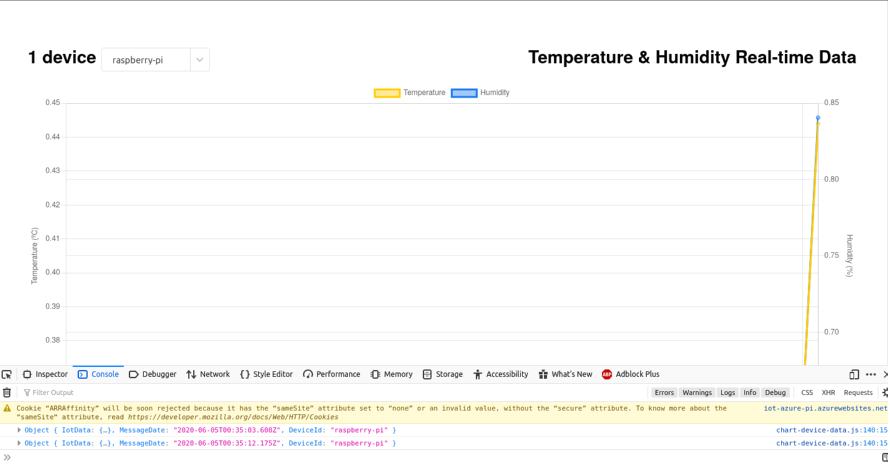

WebAppGUI
===================

## [Opis](#opis)

WebAppGUI jest to aplikacja webowa przeznaczona dla użytkownika w celu zarządzania całym środowiskiem. Użytkownik może, za jej pomocą, wizualizować otrzymane dane, oraz sterować parametrami takimi jak wilgotność gleby oraz natężenie światła. Aplikacja może być uruchomiona lokalnie - użytkownik będzie musiał być w tej samej sieci by móc się nią posługiwać, lub uruchomiona na środowisku *Azure App Service*, przez co użytkownik będzie miał dostęp do aplikacji z każdego miejsca gdzie będzie miał dostęp do internetu.

-----------------------
## [Schemat aplikacji](#schemat-aplikacji) 

Na powyższym rysunku jest pokazany szkic projektu aplikacji WebAppGUI.

-----------------------
## [Opis kodu projektu](#opis-kodu-projektu) 

Kod projektu jest dostępny w branchu [*app_develop*](https://github.com/Kankarollo/IoTAzurePi/tree/app_develop).

TODO

-----------------------
## [Status obecny](#status-obecny)

Na chwilę obecną udało się stworzyć podstawową wersję prezentacyjną. Pozwala ona na stworzenie wykresu na podstawie otrzymanych danych z Iot Hub'a. W celach testowych aplikacja obsługuje 2 podstawowe typy otrzymanych danych (Temperatura i wilgotność). Wynik jest widoczny na poniższym obrazku. 

Prace są wykonywane na branchu [app_develop](https://github.com/Kankarollo/IoTAzurePi/tree/app_develop).

Wymagane:
 - Wersja python >= 3.6
 - Posiadanie instancji [IoT Hub](https://docs.microsoft.com/en-us/azure/iot-hub/iot-hub-create-through-portal)
 - Posiadanie instancji [Azure Cosmos DB](https://docs.microsoft.com/en-us/azure/cosmos-db/create-sql-api-python) 

Uruchomienie:

- Ściągnąć repozytorium

        git clone https://github.com/Kankarollo/IoTAzurePi.git

- Przenieść się na branch komunikacji dwustronnej
  
        git checkout origin\app_develop

- Zainstalować wymagane biblioteki :

        python -m pip -r requirements.txt

- Ustawić zmienne środowiskowe
  - IotHubConnectionString - Znajdziemy je w iot hub/Shared access policies/service pole Connection string-primary key.
  - EventHubConsumerGroup - W iot hub/settings/built-in endpoints nazwa Consumer Groups. Domyślnie - "$Default".
  - mongoDBConnectionString - azure comsos DB account/Settings/Connection String/ Pole **Primary Connection String**

    **Linux**

        export IotHubConnectionString='device connection string'
        export EventHubConsumerGroup='event '
        export mongoDBConnectionString='device connection string'

    **Windows (cmd)**

        set IotHubConnectionString='device connection string'
        set EventHubConsumerGroup='event '
        set mongoDBConnectionString='device connection string'

- Uruchom program main.py

        python main.py
